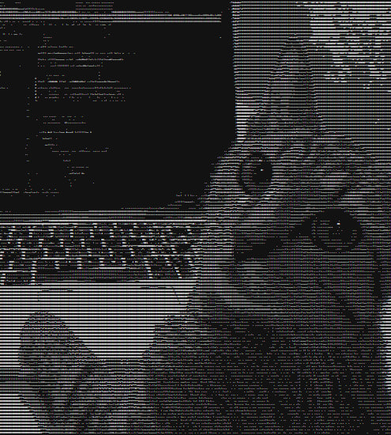

# Asciify-cpp

Convert images into ASCII art with ease! 🎨💻

## Table of Contents
- [Overview](#overview)
- [Features](#features)
- [Installation](#installation)
- [Usage](#usage)
- [Examples](#examples)
- [Contributing](#contributing)
- [License](#license)

## Overview
**Asciify** is a lightweight tool that converts images into ASCII art. Perfect for retro-style text visuals, console-based artwork, or just having fun with your images in a text-only environment.  

This project was built in **C++**, focusing on simplicity, performance, and portability.

## Features
- Convert images of various formats to ASCII
- Adjustable width and height for output
- Supports color and grayscale modes
- Command-line interface for easy usage
- Minimal dependencies (fully self-contained)

<p align="center">
  
</p>

## Installation
1. Clone the repository:
```bash
git clone https://github.com/ThunderKhan/asciify-cpp.git
cd asciify
```
2. Build the project (assuming g++ and cmake is installed):
```bash
cmake -S . -B build
cmake --build build
```
## Usage
```bash
./build/asciify <image path> output.txt
```
## Contributing
Contributions, suggestions, and bug reports are welcome!
Feel free to fork the repo, make changes, and open a pull request.

## License
This project is licensed under the MIT License.
